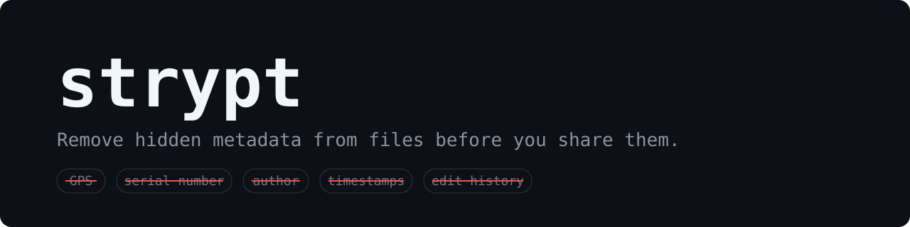
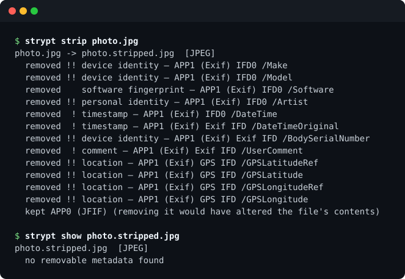

Photos carry GPS coordinates and camera serial numbers. PDFs carry author names, organisation
names, and editing timestamps. Word documents carry all of that plus the editing sessions they
were written in — and the photographs pasted into them arrive with their own GPS still attached.
None of it is visible in a normal viewer, and all of it survives to publication. strypt finds it
and strips it out.

A single self-contained binary. Memory-safe Rust. **No network access in any code path.**

> **Status: `0.0.1`, not a release. No external audit.** Read
> [`docs/KNOWN_LIMITATIONS.md`](docs/KNOWN_LIMITATIONS.md) before relying on strypt.
> Phases 0–3 are complete; prebuilt binaries and signing are Phase 4 ([`docs/ROADMAP.md`](docs/ROADMAP.md)).

[](https://github.com/FadeHack/strypt/actions/workflows/ci.yml)
[](https://github.com/FadeHack/strypt/actions/workflows/no-network.yml)
[](https://github.com/FadeHack/strypt/actions/workflows/deny.yml)
[](#licence)



<sub>A synthetic test photo from <code>corpus/</code>; its GPS, serial number and author are invented.</sub>

## Formats

| Kind | Formats |
|---|---|
| Images | JPEG, PNG, WebP, TIFF, GIF, HEIF/AVIF (`.heic`, `.heif`, `.avif`), SVG, JPEG XL |
| Documents | PDF; Office Open XML (`.docx`, `.xlsx`, `.pptx`); OpenDocument (`.odt`, `.ods`, `.odp`) |
| Audio and video | FLAC, WAV, MP3, Ogg (`.ogg`, `.opus`, `.oga`), MP4/M4A (`.mp4`, `.m4v`, `.m4a`, `.m4b`) |

Photographs inside a document are stripped by the image handlers. Every other format is reported
as unsupported and never passed through. What each handler removes, keeps, and refuses:
[`docs/THREAT_MODEL.md`](docs/THREAT_MODEL.md) §7.

**For other formats, use [mat2](https://github.com/jvoisin/mat2) or
[ExifTool](https://exiftool.org/)** — both mature, actively maintained, and covering far more
formats. Where mat2 is the better tool for a file strypt does support,
[`docs/KNOWN_LIMITATIONS.md`](docs/KNOWN_LIMITATIONS.md#where-mat2-is-the-better-choice) says so.

## Why trust the output

Evidence, not an audit — each point links to where it is checked.

- **It fails closed.** A file strypt cannot fully process produces no output, and an unsupported
  format is reported as unsupported, never passed through.
- **It re-reads its own output.** Every stripped file is detected and inspected afresh, and
  discarded (exit 5) if anything the handler recognises survived. That proves consistency, not
  omniscience ([`docs/THREAT_MODEL.md`](docs/THREAT_MODEL.md) §4.8).
- **It cannot phone home.** CI rejects any dependency that can open a network connection,
  transitive ones included, and [proves that check fails](INSTRUCTIONS.md#proving-the-gates-fail)
  on every push (ADR-0004).
- **No `unsafe` in strypt's own code**, enforced by the compiler; dependencies are checked
  against RustSec advisories on every push and weekly.
- **Every parser is fuzzed.** 20 of 22 fuzz targets meet the bar of 24 CPU-hours with saturated
  coverage (ADR-0044); `jxl` and `png` do not yet. All 22 run for a minute on every push.
- **Every format is compared against mat2 and ExifTool**, and each difference is recorded as a
  bug or a deliberate choice ([`docs/THREAT_MODEL.md`](docs/THREAT_MODEL.md) §7).

## What strypt will *not* do

- It does not redact. A PDF with a black box drawn over text still contains that text.
- It does not change what your document *says*, or anonymise your writing style.
- It does not clean filenames, and `budget_final_jsmith_home.pdf` identifies you regardless.
- It does not protect against metadata a platform adds after you upload.
- It cannot defeat fingerprinting — encoder quirks and camera sensor noise can identify a
  device from pixel data alone, with no metadata present at all.
- **No tool can guarantee complete metadata removal from complex formats.** strypt will never
  claim otherwise.

## Before you publish

1. **Rename the file.** strypt keeps the name you gave it, plus `.stripped`.
2. **Look at what is visible**: faces, screens, reflections, street signs, and the text itself.
3. **Check the stripped copy** with `strypt show`, and read what `strip` said it kept.
4. **Upload only the stripped copy.** A platform may store the file you send even when it shows a
   re-encoded one.

**If strypt calls a file clean and it still carries metadata, that is a security vulnerability.**
Report it privately through [`SECURITY.md`](SECURITY.md), not in a public issue.

## Install

```sh
cargo install strypt    # requires a Rust toolchain
```

That is the only install path until Phase 4. `strypt-cli` on crates.io is the same tool under
its original name, yanked on 2026-08-23 (ADR-0026); replace it with `strypt`.

Tested in CI on Linux, macOS and Windows. On Windows, output takes the permissions of the folder
it is written to ([`docs/KNOWN_LIMITATIONS.md`](docs/KNOWN_LIMITATIONS.md#everywhere)).

## Usage

```sh
strypt show photo.jpg                  # report what metadata is present; changes nothing
strypt strip photo.jpg                 # write a sanitised copy beside the original
strypt strip --output-dir out/ *.pdf   # write copies elsewhere
strypt strip --in-place report.docx    # overwrite the original (opt-in, never the default)
strypt show --json --recursive ./docs  # machine-readable output for scripting
```

A failure is loud: a file strypt cannot fully process produces no output. Commands and exit
codes: [`INSTRUCTIONS.md`](INSTRUCTIONS.md).

`show` exits non-zero when anything is left to deal with, so a publishing script or CI job can
refuse to ship metadata:

```sh
strypt show --recursive public/images > /dev/null   # 1: metadata found; 4: a file strypt cannot check
```

## Documentation

| Document | Contents |
|---|---|
| [`docs/KNOWN_LIMITATIONS.md`](docs/KNOWN_LIMITATIONS.md) | What strypt keeps, cannot see, and refuses, per format |
| [`docs/THREAT_MODEL.md`](docs/THREAT_MODEL.md) | Adversaries, protections, and limits |
| [`docs/PRD.md`](docs/PRD.md) | Problem, users, requirements, and where strypt differs from mat2 |
| [`docs/ARCHITECTURE.md`](docs/ARCHITECTURE.md) | System design, dependencies, security architecture |
| [`docs/ROADMAP.md`](docs/ROADMAP.md) | Phases, deliverables, exit criteria |
| [`docs/DECISIONS.md`](docs/DECISIONS.md) | Architecture decision records |
| [`docs/TESTING_STRATEGY.md`](docs/TESTING_STRATEGY.md) | How correctness is verified |
| [`CONTRIBUTING.md`](CONTRIBUTING.md) | How to contribute, and how development is [AI-assisted under constraints](CONTRIBUTING.md#development-process-ai-assisted-under-constraints) |
| [`SECURITY.md`](SECURITY.md) | Reporting vulnerabilities |
| [`INSTRUCTIONS.md`](INSTRUCTIONS.md) | Build, test, and lint commands |

## Licence

Dual-licensed under [MIT](LICENSE-MIT) or [Apache-2.0](LICENSE-APACHE), at your option.
Contributions are accepted under the same dual licence, per the Apache-2.0 contribution clause,
unless you state otherwise.
